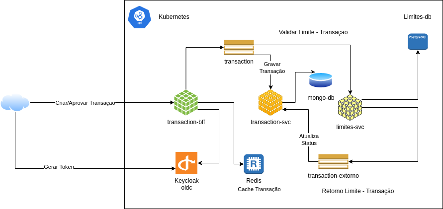

# Coffeeandit Spring

## Conteúdo Programático

- [x] Aula 0 - Configurando Ambiente (JDK e Gradle)

- [x] Aula 0.1 - Criando o projeto Spring

- [x] Aula 01 - API Rest

- [x] Aula 02 - OpenAPI

- [x] Aula 03 - Cache com Spring Data Redis

- [x] Aula 04 - Spring Data

- [x] Aula 05 - Database Migrations com Flyway

- [x] Aula 06 - Spring Data Mongo

- [ ] Aula 06.1 - OpenFeign

- [ ] Aula 07 - Exception Handler

- [ ] Aula 08 - Circuit Breaker

- [ ] Aula 09 - Spring Retry

- [ ] Aula 10 - CDI

- [ ] Aula 11 - Spring Kafka Producer

- [ ] Aula 12 - Spring Kafka Consumer

- [ ] Aula 12.1 - Spring Kafka Consumer

- [ ] Aula 13 - Reactive Mono

- [ ] Aula 14 - Reactive Flux

- [ ] Aula 15 - Spring Cloud Config

- [ ] Aula 16 - Docker

- [ ] Aula 17 - Spring Native

- [ ] Aula 18 - Spring Cloud Functions

- [ ] Aula 19 - Aws S3

- [ ] Aula 20 - Vault

- [ ] Aula 21 - Spring Cloud Kubernetes

- [ ] Aula 22 - Micrometer, Prometheus e Actuator

- [ ] Aula 23 - OpenTelemetry

- [ ] Aula 24 - Spring Security